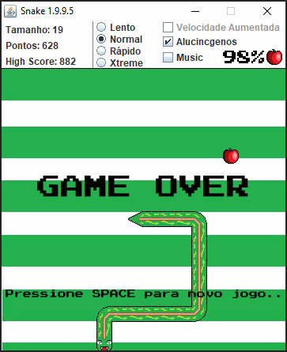
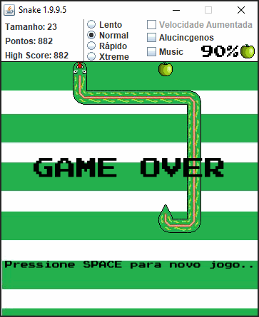

# Snake

Simple snake game with a psychedelic twist

My first game with graphics made all the way back in 2015

### Psychedelic Mode

### Default Mode

**Features**
- Music
- Sound Effects
- Deteriorating timer, more points the faster you eat your next food
- More points for each wall touching the food 
- 4 speeds (Faster equals more points)
- Chips, rare food that gives more points
- Psychedelic mode
- Speed mode
- Highscore tracker

- **Unlock System**  
    (2000 points) **Chips**:  Chips starts to show, they're tastier then apples.  
    (3000 points) **Music**:  Enjoy some 8 bit tunes while playing.  
    (4000 points) **XTreme Speed**:  Professional speed mode.  
    (5250 points) **Speed mode**:  It gets faster with each food.  
    (ENABLE BY DEFAULT) **Psychedelic mode**: Let's change the diet a bit, what about some mushrooms...
    
You can change the menu configurations by dying :)
